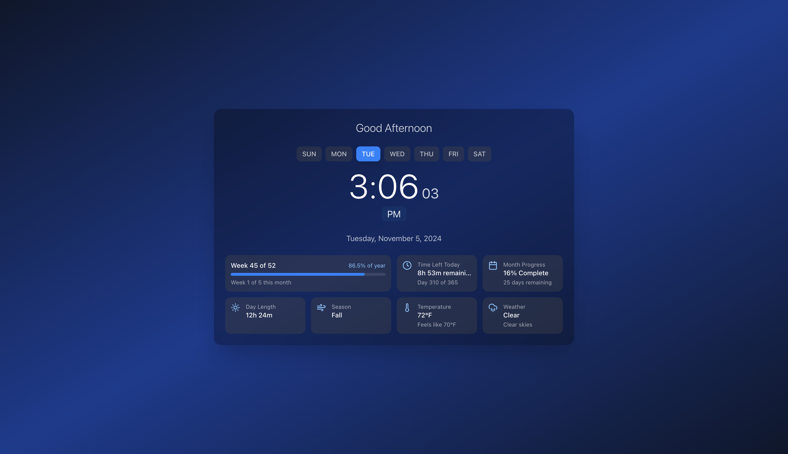

# ⏰ Eclipse Clock

**Eclipse Clock APK** - a modern digital clock app with a unique, customizable interface. Built using **React** and **Tailwind CSS** for a sleek and responsive design.

---

## 📋 Table of Contents

- [Project Overview](#project-overview)
- [Features](#features)
- [Project Structure](#project-structure)
- [Getting Started](#getting-started)
- [Available Scripts](#available-scripts)
- [Usage](#usage)
- [Preview](#preview)
- [License](#license)

---

## 🌐 Project Overview

**Eclipse Clock** is a custom APK for a digital clock with an elegant, user-friendly design. Built with **React** and styled with **Tailwind CSS**, it provides a responsive experience for both mobile and desktop. Open Graph and Twitter Card meta tags are included for optimized social media sharing.

---

## ✨ Features

- **Responsive Design**: Tailwind CSS ensures compatibility across mobile and desktop.
- **Customizable Interface**: Easily adjust settings for a personalized clock display.
- **Cross-Browser Compatibility**: Optimized for smooth performance on various devices and browsers.
- **Social Media Ready**: Includes Open Graph and Twitter Card meta tags for enhanced visibility.

---

## 📂 Project Structure

```plaintext
├── .gitattributes
├── .gitignore
├── LICENSE
├── README.md
├── dist
│   └── output.css
├── package-lock.json
├── package.json
├── postcss.config.js
├── public
│   ├── favicon_io
│   │   ├── android-chrome-192x192.png
│   │   ├── android-chrome-512x512.png
│   │   ├── apple-touch-icon.png
│   │   ├── favicon-16x16.png
│   │   ├── favicon-32x32.png
│   │   ├── favicon.ico
│   │   └── site.webmanifest
│   └── index.html
├── src
│   ├── App.js
│   ├── components
│   │   └── DigitalClock.js
│   ├── index.css
│   └── index.js
└── tailwind.config.js
```

## 🚀 Getting Started

### Prerequisites

- **Node.js** (v14+)
- **npm** (v6+)

### Installation

1. **Clone the repository:**

```bash
git clone https://github.com/your-username/eclipse-clock.git
```
2.	Navigate to the project directory:
```bash
cd eclipse-clock
```

3.	Install dependencies:
```bash
npm install
```

4.	Start the development server:
```bash
npm start
```

5.	Build for production:
```bash
npm run build
```


## 📜 Available Scripts

-npm start: Runs the app in development mode.
-npm run build: Builds the app for production, outputting files to the dist folder.

## 💻 Usage

After installation, access the app by visiting http://localhost:3000 in your browser. To host the APK online, consider deploying it to a platform like Vercel or Netlify.

## 👀 Preview

Here’s a sneak peek of the Eclipse Clock APK:



---

## 📄 License

This project is licensed under the **MIT License**. See the [LICENSE](./LICENSE) file for details.


